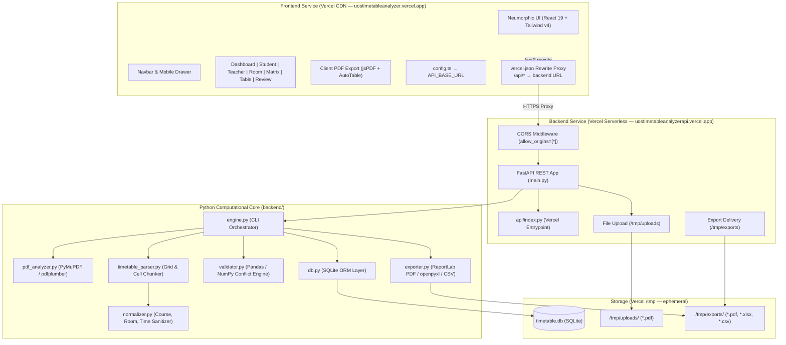

# 🎓 Smart Timetable Analyzer & Master Schedule Ledger

<div align="center">


<p align="center">
  <strong>An Intelligent University Timetable Extraction, Schedule Management, and Conflict Analysis Engine</strong>
  <br />
  Featuring a <em>Peach Cream & Terracotta</em> Neumorphic & Skeuomorphic tactile design system with 100% mobile responsiveness.
  <br />
  <strong>Architected with decoupled, standalone <code>frontend/</code> and <code>backend/</code> services — both deployed independently on Vercel.</strong>
</p>

<p align="center">
  🌐 <strong>Live Demo:</strong>
  &nbsp;
  <a href="https://uostimetableanalyzer.vercel.app/" target="_blank"><strong>Frontend →</strong></a>
  &nbsp;|&nbsp;
  <a href="https://uostimetableanalyzerapi.vercel.app/" target="_blank"><strong>Backend API →</strong></a>
</p>

</div>

---

## 📑 Table of Contents

- [Overview](#-overview)
- [Live Deployments](#-live-deployments)
- [Design Aesthetics & Theme](#-design-aesthetics--theme)
- [Key Features](#-key-features)
- [System Architecture](#-system-architecture)
- [Project Directory Structure](#-project-directory-structure)
- [Tech Stack & Dependencies](#-tech-stack--dependencies)
- [REST API Reference](#-rest-api-reference)
- [Local Development Setup](#-local-development-setup)
- [Production Deployment Guide](#-production-deployment-guide)
- [Core Workflows](#-core-workflows)
- [License & Credits](#-license--credits)

---

## 🌟 Overview

Academic timetables published by universities are almost universally distributed as dense, multi-page vector or grid PDF documents. These files often present severe usability hurdles:
- **Overlapping/Clipped text**: Column and cell boundaries in PDFs clip long course titles, instructor names, or room numbers.
- **Inability to filter**: Students and faculty cannot quickly isolate their own sections or courses from hundreds of classes.
- **Undetected schedule conflicts**: Room double-bookings or overlapping instructor assignments often go unnoticed until classes begin.
- **Poor mobile experience**: Viewing large matrix tables on phones requires continuous pinching and zooming.

**Smart Timetable Analyzer** solves this through a decoupled, high-performance architecture:
1. An intelligent **Python FastAPI backend** that handles file uploads, executes the PDF parsing pipeline, manages the SQLite database, and delivers data and exports via a clean REST API.
2. A **React 19 single-page application** crafted with a custom **Peach Cream & Terracotta** skeuomorphic design system featuring 100% responsive layouts, role-based views, tactile controls, and dynamic filter-compliant PDF exports.
3. A **Vercel rewrite proxy** on the frontend seamlessly forwards all `/api/*` calls to the backend — no CORS issues, no environment variable juggling.

---

## 🚀 Live Deployments

| Service | URL | Platform |
| :--- | :--- | :--- |
| 🌐 **Frontend** | [https://uostimetableanalyzer.vercel.app](https://uostimetableanalyzer.vercel.app/) | Vercel (Vite/React) |
| ⚙️ **Backend API** | [https://uostimetableanalyzerapi.vercel.app](https://uostimetableanalyzerapi.vercel.app/) | Vercel (Python/FastAPI) |

> **How they connect:** The frontend's `vercel.json` contains a rewrite rule that transparently proxies all `/api/*` requests from the frontend domain to the backend domain. The frontend code simply calls `/api/timetable` — Vercel handles the rest.

---

## 🎨 Design Aesthetics & Theme

The user interface is built on a custom **Peach Cream & Terracotta** color palette, combining soft neumorphic raised cards, recessed wells, and physical skeuomorphic buttons:

### Curated Color Palette
- **Canvas / Background**: `#FFF8F2` (Soft warm peach cream)
- **Primary Accent**: `#E76F51` (Rich vibrant terracotta)
- **Primary Hover / Shadow**: `#C05633` (Deep burnt terracotta)
- **Secondary Surface**: `#FCEFE3` (Warm cream peach container)
- **Borders & Insets**: `#D4B8A0` (Subtle warm clay border)
- **Typography (Headings)**: `#3D2B1F` (Espresso dark brown)
- **Typography (Muted/Subtext)**: `#7A6559` & `#A0897D` (Medium warm slate)

### Tactile Neumorphic & Skeuomorphic Primitives
- **`.neu-raised`**: Dual-directional shadows creating a soft, elevated clay plate appearance.
- **`.neu-pressed`**: Sunken inner shadows providing tactile input wells, search bars, and toggle switches.
- **`.skeuo-btn-primary`**: 3D glossy terracotta buttons with bevel highlights, dark bottom lips, and tactile depression on click.
- **LED Indicators**: Glowing green (`.skeuo-led-green`) and red (`.skeuo-led-red`) lights signifying clean grids or conflict warnings.
- **Mobile First & Fully Responsive**: Includes a dedicated mobile hamburger toggle menu drawer, adaptive grids (`1 → 2 → 4` columns), swipe guidance banners, and auto-scrolling dialogs.

---

## 🚀 Key Features

### 1. AI & Coordinate-Anchored PDF Extraction
- Automatically parses multi-page university timetable PDFs with arbitrary grid geometries.
- **Canonical Catalog Extraction**: Inspects master index pages (e.g. Page 1) to identify unclipped, canonical degree names (e.g. `BS Software Engineering Semester 3 Self Support 2 (2025-2029)`) and faculty rosters.
- **Multi-Lecture Cell Chunking**: Detects stacked classes occurring within the same time slot and splits them into distinct database entries.
- **Text Normalization**: Cleans course codes, sanitizes time strings into standardized `HH:MM AM/PM` formats, and computes durations.

### 2. Role-Based Navigation
- **Student View**: Cascading dropdowns (Program ➔ Semester ➔ Section) with day-by-day lecture cards, teacher chips, and room locations.
- **Teacher Schedule**: Instructor picker and quick search filter with total weekly lecture count, teaching days, and cumulative teaching hours.
- **Admin View**: Master database ledger with full CRUD capabilities (Add, Edit, Delete records), column sorting, and paginated browsing.

### 3. Interactive Schedule Views
- **Executive Dashboard**: 8 tactile KPI cards (Total Classes, Programs, Faculty, Rooms, Hours, Active Days, Conflicts, Audit Flags) and a 6-day academic load distribution bar chart.
- **Weekly Master Matrix**: 2D Day × Time cross-reference matrix with swipe hints for mobile and a floating cell inspector dialog.
- **Room & Lab Schedule**: Real-time room occupancy tracker, lab utilization metrics, and free period detection.
- **Extraction Review & Conflict Audit**: Automated conflict detection identifying teacher double-bookings and room collision overlaps.
- **Built-in PDF Viewer**: Side-by-side or modal high-resolution vector PDF inspection with page-jump capabilities.

### 4. Multi-Format Filter-Aware Exports
- **Client-Side Official PDF**: Generates colorful, branded PDFs via `jsPDF` & `jspdf-autotable` with double-line borders, metadata header boxes, colored alternating rows, and active filter compliance.
- **Server-Side ReportLab PDF**: Backend high-resolution vector PDF export with page decoration banners and page numbering.
- **Excel (.xlsx)**: Formatted workbooks with auto-fitted column widths and styled headers.
- **CSV Dataset**: Raw data export for external spreadsheet manipulation.

### 5. Multi-Timetable Version Manager
- Upload and store multiple timetables concurrently in SQLite.
- Seamlessly switch active schedules with one click.
- Safe deletion flow with confirmation prompts.

---

## 🏗 System Architecture



---

## 📁 Project Directory Structure

The project is strictly organized into two independent, self-contained directories — everything frontend-related is inside `frontend/`, and everything backend-related is inside `backend/`. Nothing crosses these boundaries.

```text
TimeTableAnalyzer/
│
├── frontend/                          # 🌐 CLIENT APPLICATION (Vercel)
│   ├── src/
│   │   ├── components/
│   │   │   ├── AdminDataTable.tsx     # CRUD database records explorer
│   │   │   ├── DashboardStats.tsx     # 8 KPI cards & load distribution chart
│   │   │   ├── EditRecordModal.tsx    # Add / Edit record dialog
│   │   │   ├── ExtractionReviewView.tsx  # Conflict diagnostics view
│   │   │   ├── Navbar.tsx             # Tactile navigation & mobile drawer
│   │   │   ├── PdfViewerModal.tsx     # Vector PDF viewer modal
│   │   │   ├── RoomScheduleView.tsx   # Venue occupancy & lab tracker
│   │   │   ├── StudentScheduleView.tsx   # Student cascading schedule view
│   │   │   ├── TeacherScheduleView.tsx   # Faculty workload analysis
│   │   │   ├── UploadModal.tsx        # PDF upload & parsing modal
│   │   │   └── WeeklyMatrixView.tsx   # 2D Day × Time matrix view
│   │   ├── lib/
│   │   │   └── pdfExport.ts           # Client-side jsPDF + AutoTable export
│   │   ├── App.tsx                    # Main app controller & state manager
│   │   ├── config.ts                  # API_BASE_URL config (reads VITE_API_URL)
│   │   ├── index.css                  # Design tokens & Neumorphic utilities
│   │   ├── main.tsx                   # React DOM root mount
│   │   └── types.ts                   # TypeScript interfaces & shared types
│   ├── index.html                     # HTML entry template
│   ├── package.json                   # Frontend npm dependencies & scripts
│   ├── tsconfig.json                  # Frontend TypeScript config
│   ├── vercel.json                    # Vercel SPA routing + API rewrite proxy
│   ├── vite.config.ts                 # Vite build config & local dev proxy (:8000)
│   └── .env.example                   # Frontend env variables reference
│
├── backend/                           # ⚙️ PYTHON FASTAPI SERVER (Vercel)
│   ├── api/
│   │   └── index.py                   # Vercel serverless entrypoint (imports app)
│   ├── database/
│   │   └── db.py                      # SQLite schema, queries & versioning
│   ├── services/
│   │   ├── exporter.py                # ReportLab PDF, openpyxl Excel, CSV
│   │   ├── normalizer.py              # Time formatting & text sanitation
│   │   ├── pdf_analyzer.py            # PyMuPDF coordinate inspection
│   │   ├── table_extractor.py         # pdfplumber grid extraction
│   │   ├── timetable_parser.py        # Cell chunking & canonical mapping
│   │   └── validator.py               # Pandas / NumPy conflict detection
│   ├── engine.py                      # Python CLI & pipeline orchestrator
│   ├── main.py                        # FastAPI application & all API routes
│   ├── requirements.txt               # Python pip dependencies
│   ├── vercel.json                    # Vercel Python runtime config
│   ├── Dockerfile                     # Multi-stage production container (optional)
│   ├── .dockerignore                  # Docker build exclusions
│   └── .env.example                   # Backend env variables reference
│
├── .gitignore                         # Root Git ignore rules
└── README.md                          # Project documentation (this file)
```

---

## 📦 Tech Stack & Dependencies

### Frontend Service (`frontend/`)
| Technology | Version | Purpose |
| :--- | :--- | :--- |
| **React** | `^19.0.1` | Modern declarative UI component library |
| **TypeScript** | `^7.0.2` | Static type checking and interfaces |
| **Vite** | `^8.3.0` | Ultra-fast build tool & local dev proxy |
| **Tailwind CSS** | `^4.3.3` | Utility styling with CSS variable support |
| **Lucide React** | `^0.546.0` | Consistent UI icon set |
| **Motion** | `^12.x` | Smooth micro-animations & transitions |
| **jsPDF** | `^4.2.1` | Client-side vector PDF generation |
| **jspdf-autotable** | `^5.0.8` | Formatted multi-page data tables in PDFs |
| **xlsx (SheetJS)** | `^0.18.5` | Client-side spreadsheet export |
| **canvas-confetti** | `^1.9.4` | Micro-animation celebration triggers |

### Backend Service (`backend/`)
| Technology | Version | Purpose |
| :--- | :--- | :--- |
| **Python** | `>=3.11` | Core runtime for the backend service |
| **FastAPI** | `>=0.104.0` | High-performance async REST API framework |
| **Uvicorn** | `>=0.23.2` | ASGI server for local development |
| **python-multipart** | `>=0.0.6` | Multipart/form-data PDF file uploads |
| **PyMuPDF (fitz)** | `>=1.23.0` | High-speed PDF layout & coordinate analysis |
| **pdfplumber** | `>=0.10.0` | Visual table boundary detection |
| **pandas** | `>=1.5.0` | Tabular data grouping and conflict analysis |
| **numpy** | `>=1.24.0` | Vector operations and matrix sorting |
| **openpyxl** | `>=3.0.0` | Formatted Excel workbook exports |
| **ReportLab** | `>=4.0.0` | Vector PDF document generation |
| **SQLite3** | Built-in | Relational database persistence |

---

## 🔌 REST API Reference

Base URL (Production): `https://uostimetableanalyzerapi.vercel.app`

| Method | Endpoint | Description | Parameters |
| :--- | :--- | :--- | :--- |
| `GET` | `/` | Service info & version | None |
| `GET` | `/api/health` | Service health check | None |
| `POST` | `/api/upload` | Upload PDF to server storage | Multipart `pdf` file |
| `POST` | `/api/analyze` | Run Python extraction pipeline | `{ filename, originalName }` |
| `POST` | `/api/upload-and-analyze` | Upload, parse & save PDF in 1 step | Multipart `pdf` file |
| `POST` | `/api/sample-timetable` | Generate and load default sample | None |
| `GET` | `/api/timetable` | Get active or specific timetable | `?id=<timetable_id>` |
| `GET` | `/api/timetables` | List all uploaded timetables | None |
| `POST` | `/api/timetables/active/:id` | Set a timetable as active | Path `:id` |
| `DELETE` | `/api/timetables/:id` | Delete a timetable & all entries | Path `:id` |
| `GET` | `/api/filter` | Filter entries by multiple criteria | `?program=&semester=&teacher=&room=&day=&q=` |
| `GET` | `/api/student-schedule` | Get day-grouped schedule for students | `?timetableId=&program=&semester=&section=` |
| `GET` | `/api/teacher-schedule` | Get teaching load & schedule | `?timetableId=&teacher=` |
| `GET` | `/api/room-schedule` | Get occupancy for a specific room | `?timetableId=&room=` |
| `GET` | `/api/programs` | List all unique programs | `?id=<timetable_id>` |
| `GET` | `/api/teachers` | List all unique teachers | `?id=<timetable_id>` |
| `GET` | `/api/rooms` | List all unique rooms | `?id=<timetable_id>` |
| `GET` | `/api/subjects` | List all unique subjects | `?id=<timetable_id>` |
| `PUT` | `/api/records/:id` | Update a specific class record | Path `:id`, JSON body |
| `DELETE` | `/api/records/:id` | Delete a specific class record | Path `:id` |
| `GET` | `/api/pdf-view/:id` | Stream the original uploaded PDF | Path `:id` |
| `GET` | `/api/export/pdf` | Download filter-compliant ReportLab PDF | `?timetableId=&filterJson=&type=&filter=` |
| `GET` | `/api/export/excel` | Download filter-compliant Excel sheet | `?timetableId=&filterJson=&type=&filter=` |
| `GET` | `/api/export/csv` | Download filter-compliant CSV dataset | `?timetableId=&filterJson=&type=&filter=` |

---

## 🛠 Local Development Setup

### Prerequisites
- **Python**: `v3.10` or higher with `pip`
- **Node.js**: `v18.0.0` or higher (for the frontend only)

---

### 1. Backend Setup (FastAPI)

Open a terminal and run:

```bash
cd backend

# Install Python dependencies
pip install -r requirements.txt

# Start FastAPI backend server (runs on port 8000)
uvicorn main:app --reload
```

The backend starts at `http://localhost:8000`.
Verify it is running at `http://localhost:8000/api/health`.

---

### 2. Frontend Setup

Open a **second** terminal and run:

```bash
cd frontend

# Install frontend dependencies
npm install

# Start frontend development server (runs on port 5173)
npm run dev
```

Open your browser at `http://localhost:5173`.

During local development, Vite automatically proxies all `/api/*` calls from port `5173` → `http://localhost:8000` (configured in `vite.config.ts`). No extra environment variables needed.

---

## 🚀 Production Deployment Guide

Both services are deployed independently on **Vercel**. Each has its own `vercel.json` configuration.

---

### Deploying the Backend (FastAPI) on Vercel

1. Log in to [Vercel](https://vercel.com/) and click **Add New Project**.
2. Select your repository: `TimeTableAnalyzer`.
3. Under **Project Settings**:
   - **Root Directory**: `backend`
   - **Framework Preset**: `Other`
4. Add the following **Environment Variable**:
   - `VERCEL`: `1` *(tells the app to use `/tmp` for storage)*
5. Click **Deploy**.

The `backend/vercel.json` already configures `@vercel/python` runtime pointing to `api/index.py`.

> ⚠️ **Note on Storage**: Vercel is a serverless platform. The `/tmp` directory is ephemeral — uploaded PDFs and the SQLite database may reset between cold starts. This is fine for demos and testing. For permanent production storage, integrate Supabase (PostgreSQL) + AWS S3.

---

### Deploying the Frontend (React/Vite) on Vercel

1. Log in to [Vercel](https://vercel.com/) and click **Add New Project**.
2. Select your repository: `TimeTableAnalyzer`.
3. Under **Project Settings**:
   - **Root Directory**: `frontend`
   - **Framework Preset**: `Vite` (detected automatically)
   - **Build Command**: `npm run build`
   - **Output Directory**: `dist`
4. No environment variables required — the Vercel rewrite proxy in `frontend/vercel.json` handles the backend connection automatically.
5. Click **Deploy**.

### How Frontend ↔ Backend Connects in Production

```
Browser calls: fetch("/api/timetable")
        ↓
Vercel Edge (uostimetableanalyzer.vercel.app)
        ↓  matches rewrite rule in vercel.json
Proxies to: https://uostimetableanalyzerapi.vercel.app/api/timetable
        ↓
FastAPI returns JSON ✅
        ↓
Browser receives data, renders UI ✅
```

The key rule in `frontend/vercel.json`:
```json
{
  "source": "/api/(.*)",
  "destination": "https://uostimetableanalyzerapi.vercel.app/api/$1"
}
```

---

## 🔬 Core Workflows

### PDF Parsing Pipeline
1. **Coordinate Analysis**: `pdf_analyzer.py` inspects page dimensions, tables, and bounding boxes using `PyMuPDF` and `pdfplumber`.
2. **Canonical Mapping**: The engine examines header blocks and index tables to construct a canonical dictionary of degree programs, batches, and shifts.
3. **Multi-Lecture Chunking**: When multiple classes share a cell or time slot, `timetable_parser.py` isolates individual blocks using regex and text layout markers.
4. **Data Normalization**: `normalizer.py` sanitizes time spans (e.g. `08:30-10:00`), maps faculty initials to full names, and extracts room identifiers.
5. **Database Storage**: The parsed dataset is committed atomically to SQLite with version tracking via `database/db.py`.

### Conflict & Anomaly Detection
- **Teacher Double-Booking**: Evaluates whether an instructor has overlapping time allocations on the same day.
- **Room Collisions**: Identifies if two distinct classes occupy the same room at overlapping hours.
- **Confidence Scoring**: Flags anomalous entries (e.g. missing room or ambiguous subject) for administrative review.

### Multi-Format Filter-Aware Exports
- When filters are active (e.g. searching for a teacher or course), exports reflect **only the filtered dataset**.
- Client-side PDF generation provides instant, crisp vector documents formatted with official header ledger strips.

### Timetable Version Management
- Multiple timetable PDFs can be uploaded and stored concurrently.
- Only one timetable is "active" at a time — the active timetable is loaded by default across all views.
- Switching and deleting timetables is handled via the admin sidebar with full SQLite cascade deletes.

---

## 📜 License & Credits

Developed with precision for academic institutions — University of Sargodha (UOS). Built using open-source libraries:

- [FastAPI](https://fastapi.tiangolo.com/)
- [PyMuPDF](https://github.com/pymupdf/PyMuPDF)
- [pdfplumber](https://github.com/jsvine/pdfplumber)
- [React](https://react.dev/) & [Vite](https://vitejs.dev/)
- [Tailwind CSS](https://tailwindcss.com/)
- [ReportLab](https://www.reportlab.com/) & [jsPDF](https://github.com/parallax/jsPDF)
- [pandas](https://pandas.pydata.org/) & [NumPy](https://numpy.org/)
