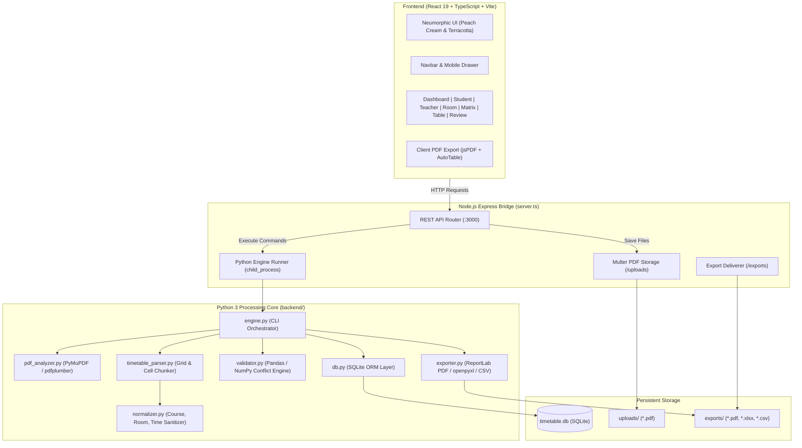

# 🎓 Smart Timetable Analyzer & Master Schedule Ledger

<div align="center">


<p align="center">
  <strong>An Intelligent University Timetable Extraction, Schedule Management, and Conflict Analysis Engine</strong>
  <br />
  Featuring a <em>Peach Cream & Terracotta</em> Neumorphic & Skeuomorphic tactile design system with 100% mobile responsiveness.
</p>

</div>

---

## 📑 Table of Contents

- [Overview](#-overview)
- [Design Aesthetics & Theme](#-design-aesthetics--theme)
- [Key Features](#-key-features)
- [System Architecture](#-system-architecture)
- [Tech Stack & Dependencies](#-tech-stack--dependencies)
  - [Frontend Ecosystem](#frontend-ecosystem)
  - [Backend & Python Engine](#backend--python-engine)
- [Project Directory Structure](#-project-directory-structure)
- [REST API Reference](#-rest-api-reference)
- [Installation & Setup Guide](#-installation--setup-guide)
  - [Prerequisites](#prerequisites)
  - [1. Clone Repository](#1-clone-repository)
  - [2. Install Node.js Dependencies](#2-install-nodejs-dependencies)
  - [3. Install Python Dependencies](#3-install-python-dependencies)
  - [4. Run in Development Mode](#4-run-in-development-mode)
  - [5. Production Build & Execution](#5-production-build--execution)
- [Core Workflows](#-core-workflows)
  - [PDF Parsing Pipeline](#pdf-parsing-pipeline)
  - [Conflict & Anomaly Detection](#conflict--anomaly-detection)
  - [Multi-Format Filter-Aware Exports](#multi-format-filter-aware-exports)
  - [Timetable Version Management](#timetable-version-management)
- [License & Credits](#-license--credits)

---

## 🌟 Overview

Academic timetables published by universities are almost universally distributed as dense, multi-page vector or grid PDF documents. These files often present severe usability hurdles:
- **Overlapping/Clipped text**: Column and cell boundaries in PDFs often clip long course titles, instructor names, or room numbers.
- **Inability to filter**: Students and faculty cannot quickly isolate their own sections or courses from hundreds of classes.
- **Undetected schedule conflicts**: Room double-bookings or overlapping instructor assignments often go unnoticed until classes begin.
- **Poor mobile experience**: Viewing large matrix tables on phones requires continuous pinching and zooming.

**Smart Timetable Analyzer** solves these challenges by combining a high-performance **Python extraction pipeline** (using `PyMuPDF`, `pdfplumber`, and `pandas`) with a **React 19 + TypeScript + Tailwind CSS v4** interface styled in a tactile **Neumorphic & Skeuomorphic Peach Cream & Terracotta** aesthetic.

---

## 🎨 Design Aesthetics & Theme

The user interface is crafted around a custom **Peach Cream & Terracotta** color palette, implementing true Neumorphic depth and Skeuomorphic tactile realism:

| Palette Role | Color Code | Description & Usage |
| :--- | :--- | :--- |
| **60% Dominant Base** | `#FFF8F2` | Soft warm peach white for overall backgrounds, outer shadow highlights, and header decks. |
| **30% Secondary Surface** | `#FCEFE3` | Warm cream for raised card bodies, recessed wells (`.neu-pressed`), and table rows. |
| **10% Accent Highlight** | `#E76F51` | Vibrant terracotta orange for primary tactile buttons, active tabs, and badges. |
| **Supporting Accent** | `#2A9D8F` | Deep emerald green for rooms, laboratories, and conflict-free verification states. |
| **Typography Base** | `#3D2B1F` | Deep espresso brown for high-contrast, readable typography. |

### Tactile Depth Elements
- **`.neu-raised` / `.skeuo-card`**: Soft convex shadows combined with subtle top-highlight borders (`#FFFDF9`) simulating physical embossed cards.
- **`.neu-pressed`**: Inset wells (`box-shadow: inset 3px 3px 6px ...`) giving inputs, trays, and toggle containers a carved, tactile feel.
- **`.skeuo-btn-primary`**: 3D glossy terracotta buttons with bevel highlights, dark bottom lips, and tactile depression on click.
- **LED Indicators**: Glowing green (`.skeuo-led-green`) and red (`.skeuo-led-red`) lights signifying clean grids or conflict warnings.
- **Mobile First & Fully Responsive**: Includes a dedicated mobile hamburger toggle menu drawer, adaptive grids (`1 → 2 → 4` columns), swipe guidance banners, and auto-scrolling dialogs.

---

## 🚀 Key Features

### 1. AI & Coordinate-Anchored PDF Extraction
- Automatically parses multi-page university timetable PDFs with arbitrary grid geometries.
- **Canonical Catalog Extraction**: Inspects master index pages (e.g. Page 1) to identify unclipped, canonical degree names (e.g. `BS Software Engineering Semester 3 Self Support 2 (2025-2029)`) and faculty rosters.
- **Multi-Lecture Cell Chunking**: Detects stacked classes occurring within the same time slot and splits them into distinct database entries.
- **Text Normalization**: Cleans course codes, sanitizes time strings into standardized `HH:MM AM/PM` formats, and computes durations.

### 2. Role-Based Navigation
- **Student View**: Cascading dropdowns (Program ➔ Semester ➔ Section) with day-by-day lecture cards, teacher chips, and room locations.
- **Teacher Schedule**: Instructor picker and quick search filter with total weekly lecture count, teaching days, and cumulative teaching hours.
- **Admin View**: Master database ledger with full CRUD capabilities (Add, Edit, Delete records), column sorting, and paginated browsing.

### 3. Interactive Schedule Views
- **Executive Dashboard**: 8 tactile KPI cards (Total Classes, Programs, Faculty, Rooms, Hours, Active Days, Conflicts, Audit Flags) and a 6-day academic load distribution bar chart.
- **Weekly Master Matrix**: 2D Day × Time cross-reference matrix with swipe hints for mobile and a floating cell inspector dialog.
- **Room & Lab Schedule**: Real-time room occupancy tracker, lab utilization metrics, and free period detection.
- **Extraction Review & Conflict Audit**: Automated conflict detection identifying teacher double-bookings and room collision overlaps.
- **Built-in PDF Viewer**: Side-by-side or modal high-resolution vector PDF inspection with page-jump capabilities.

### 4. Multi-Format Filter-Aware Exports
- **Client-Side Official PDF**: Generates colorful, branded PDFs via `jsPDF` & `jspdf-autotable` with double-line borders, metadata header boxes, colored alternating rows, and active filter compliance.
- **Server-Side ReportLab PDF**: Backend high-resolution vector PDF export with page decoration banners and page numbering.
- **Excel (.xlsx)**: Formatted workbooks with auto-fitted column widths and styled headers.
- **CSV Dataset**: Raw data export for external spreadsheet manipulation.

### 5. Multi-Timetable Version Manager
- Upload and store multiple timetables concurrently in SQLite.
- Seamlessly switch active schedules with one click.
- Safe deletion flow with confirmation prompts.

---

## 🏗 System Architecture



---

## 📦 Tech Stack & Dependencies

### Frontend Ecosystem
| Technology | Version | Purpose |
| :--- | :--- | :--- |
| **React** | `^19.0.1` | Core UI component framework |
| **React DOM** | `^19.0.1` | DOM renderer |
| **TypeScript** | `^7.0.2` | Type-safe static analysis |
| **Vite** | `^8.3.0` | Ultra-fast development server & production bundler |
| **Tailwind CSS** | `^4.3.3` | Utility-first styling framework with CSS variables |
| **@tailwindcss/vite**| `^4.3.3` | Vite native integration for Tailwind CSS v4 |
| **Lucide React** | `^0.546.0` | Consistent, modern iconography |
| **jsPDF** | `^4.2.1` | Client-side vector PDF document creation |
| **jspdf-autotable**| `^5.0.8` | Formatted multi-page table generator for jsPDF |
| **xlsx (SheetJS)** | `^0.18.5` | Client-side spreadsheet parsing and generation |
| **canvas-confetti**| `^1.9.4` | Interactive micro-animations for completed actions |

### Backend & Python Engine
| Technology | Version | Purpose |
| :--- | :--- | :--- |
| **Node.js** | `>=18.0.0` | Server runtime environment |
| **Express.js** | `^4.21.2` | Web API server & middleware framework |
| **Multer** | `^2.4.0` | Multipart form-data parser for PDF file uploads |
| **tsx** | `^4.21.0` | Direct execution of TypeScript server files |
| **esbuild** | `^0.28.0` | High-speed production bundling of `server.ts` |
| **Python** | `>=3.9` | Primary computational and extraction runtime |
| **PyMuPDF (fitz)** | `>=1.23.0` | High-speed PDF layout and vector text inspection |
| **pdfplumber** | `>=0.10.0` | Table boundary recognition and coordinate parsing |
| **pandas** | `>=1.5.0` | Tabular data manipulation, grouping, and indexing |
| **numpy** | `>=1.24.0` | Array-based vector analysis and matrix sorting |
| **openpyxl** | `>=3.0.0` | Excel (.xlsx) workbook generation with custom formatting |
| **ReportLab** | `>=4.0.0` | Professional PDF generation engine |
| **SQLite3** | Built-in | Relational database storage (`timetable.db`) |

---

## 📁 Project Directory Structure

```text
TimeTableAnalyzer/
├── backend/
│   ├── data/                   # Temporary data exchange files
│   ├── database/
│   │   └── db.py               # SQLite schema setup, CRUD queries, version management
│   ├── services/
│   │   ├── exporter.py         # ReportLab PDF, openpyxl Excel, and CSV export services
│   │   ├── normalizer.py       # Time formatting, room sanitization, text normalizers
│   │   ├── pdf_analyzer.py     # PDF metadata, coordinate extraction, page analysis
│   │   ├── table_extractor.py  # pdfplumber table extraction utilities
│   │   ├── timetable_parser.py # Cell chunking, canonical mapping, day/time association
│   │   └── validator.py        # Pandas/NumPy conflict detection & confidence scoring
│   ├── engine.py               # Python CLI command orchestrator
│   ├── requirements.txt        # Python pip dependencies
│   └── timetable.db            # Primary SQLite database file
├── exports/                    # Generated output files (PDF, XLSX, CSV)
├── uploads/                    # Stored user-uploaded PDF timetable files
├── src/
│   ├── components/
│   │   ├── AdminDataTable.tsx      # Paginated database records explorer with CRUD
│   │   ├── DashboardStats.tsx      # 8 KPI cards & weekly load balance chart
│   │   ├── EditRecordModal.tsx     # Add / Edit class record modal dialog
│   │   ├── ExtractionReviewView.tsx# Conflict audit, overlap diagnostics & review
│   │   ├── Navbar.tsx              # Tactile header, role switcher & mobile toggle drawer
│   │   ├── PdfViewerModal.tsx      # Vector PDF reader with page switcher
│   │   ├── RoomScheduleView.tsx    # Venue schedule & laboratory occupancy
│   │   ├── StudentScheduleView.tsx # Cascading student timetable finder & cards
│   │   ├── TeacherScheduleView.tsx # Faculty schedule, search & workload analysis
│   │   ├── UploadModal.tsx         # Drag & drop upload modal with parsing steps
│   │   └── WeeklyMatrixView.tsx    # 2D weekly matrix ledger & cell modal
│   ├── lib/
│   │   └── pdfExport.ts        # Client-side jsPDF + AutoTable export engine
│   ├── App.tsx                 # Root application controller, routing & search state
│   ├── index.css               # Neumorphic/Skeuomorphic design system & Tailwind setup
│   ├── main.tsx                # React root mount entry point
│   └── types.ts                # TypeScript data interfaces and contracts
├── dist/                       # Production build output
├── package.json                # Node dependencies, build scripts, project metadata
├── server.ts                   # Express server, Vite middleware & Python bridge
├── tsconfig.json               # TypeScript compiler configuration
├── vite.config.ts              # Vite configuration with React and Tailwind plugins
└── README.md                   # Comprehensive project documentation
```

---

## 🔌 REST API Reference

The backend exposes a full suite of REST endpoints over port `3000`:

| Method | Endpoint | Description | Query / Body Parameters |
| :--- | :--- | :--- | :--- |
| `POST` | `/api/upload` | Uploads PDF to server storage | Multipart `pdf` file |
| `POST` | `/api/analyze` | Executes Python extraction pipeline | `{ filename, originalName }` |
| `POST` | `/api/upload-and-analyze` | Ingests, parses, and saves PDF in 1 step | Multipart `pdf` file |
| `POST` | `/api/sample-timetable` | Generates and loads default sample schedule | None |
| `GET` | `/api/timetable` | Retrieves active or specific timetable | `?id=<timetable_id>` |
| `GET` | `/api/timetables` | Lists all uploaded timetables with metadata | None |
| `POST` | `/api/timetables/active/:id` | Sets the specified timetable as active | Path `:id` |
| `DELETE`| `/api/timetables/:id` | Deletes a timetable and all its entries | Path `:id` |
| `GET` | `/api/filter` | Filters entries by attributes or search query | `?program=&semester=&teacher=&room=&day=&q=` |
| `GET` | `/api/student-schedule` | Groups entries by day for student views | `?timetableId=&program=&semester=&section=` |
| `GET` | `/api/teacher-schedule` | Computes teaching load and day schedules | `?timetableId=&teacher=` |
| `GET` | `/api/room-schedule` | Computes occupancy for a specific room | `?timetableId=&room=` |
| `PUT` | `/api/records/:id` | Updates a specific class record | Path `:id`, JSON body with fields |
| `DELETE`| `/api/records/:id` | Deletes a specific class record | Path `:id` |
| `GET` | `/api/pdf-view/:id` | Streams the original uploaded PDF | Path `:id` |
| `GET` | `/api/export/pdf` | Downloads filter-compliant ReportLab PDF | `?timetableId=&filterJson=&type=&filter=` |
| `GET` | `/api/export/excel` | Downloads filter-compliant Excel sheet | `?timetableId=&filterJson=&type=&filter=` |
| `GET` | `/api/export/csv` | Downloads filter-compliant CSV dataset | `?timetableId=&filterJson=&type=&filter=` |

---

## 🛠 Installation & Setup Guide

### Prerequisites
Make sure the following tools are installed on your machine:
- **Node.js**: `v18.0.0` or higher ([Download Node.js](https://nodejs.org/))
- **Python**: `v3.9` or higher ([Download Python](https://www.python.org/))
- **Package Managers**: `npm` (bundled with Node) and `pip` (bundled with Python)

---

### 1. Clone Repository
```bash
git clone https://github.com/aliikram12/TimeTableAnalyzer.git
cd TimeTableAnalyzer
```

---

### 2. Install Node.js Dependencies
Install the required frontend and server packages:
```bash
npm install
```

---

### 3. Install Python Dependencies
Install the Python extraction, data processing, and document generation packages:
```bash
pip install -r backend/requirements.txt
```

> **Note for Windows Users**: Ensure `python` is added to your system `PATH`. The server automatically invokes `python` on Windows and `python3` on Linux/macOS.

---

### 4. Run in Development Mode
Start the development server (runs Express and Vite HMR concurrently):
```bash
npm run dev
```

Open your browser and navigate to:
```text
http://localhost:3000
```

---

### 5. Production Build & Execution
To compile the TypeScript client into optimized static assets and bundle `server.ts`:
```bash
npm run build
npm start
```

---

## 🔄 Core Workflows

### PDF Parsing Pipeline
1. **Upload**: The user uploads a university timetable PDF via the tactile drag-and-drop modal.
2. **Inspection**: `PDFAnalyzer` examines total page count, font metrics, and bounding box coordinates using PyMuPDF.
3. **Canonical Discovery**: Scans initial index pages for unclipped degree titles (e.g. `BS Computer Science`, `BS Artificial Intelligence`) and instructors.
4. **Table Reconstruction**: `pdfplumber` extracts table cell bounding boxes. Cells with multiple lectures in one time block are split into distinct records.
5. **Normalization**: `normalizer.py` cleans whitespace, sanitizes times (e.g. `09:00 - 10:30`), and assigns department codes.
6. **Persistence**: Saves normalized entries, metadata, and generated analytics to `timetable.db` in SQLite.

### Conflict & Anomaly Detection
The validator (`validator.py`) utilizes Pandas DataFrame cross-tabulations to detect:
- **Teacher Double-Booking**: Any teacher assigned to more than one lecture at the exact same day and time interval.
- **Room Double-Booking**: Any room or lab scheduled for more than one class simultaneously.
- **Confidence Auditing**: Identifies incomplete fields (e.g. missing room, unassigned instructor) and flags them for manual admin review.

### Multi-Format Filter-Aware Exports
When exporting to PDF, Excel, or CSV:
- **Search and Filter Awareness**: If you have searched for a teacher (`"Dr. Asif"`) or filtered by a specific degree program (`"BS SE"`), the export engine respects these active filters.
- **Visual Design**: Exported PDFs contain dual-line skeuomorphic framing, terracotta header accents, clean tabular data, and academic metadata stamps.

### Timetable Version Management
- Manage multiple semester timetables (e.g., Fall 2025, Spring 2026).
- Use the **Timetable Version Manager** in the navbar to switch between datasets or delete older versions with instant SQLite cascades.

---

## 📄 License & Credits

Developed with ❤️ as a modern academic scheduling and document intelligence solution.

- **Author**: Ali Ikram ([@aliikram12](https://github.com/aliikram12))
- **Design System**: Peach Cream & Terracotta Neumorphic Architecture
- **Engine**: Python PyMuPDF + Pandas Grid Coordinate Parser

---

<div align="center">
  <sub>Built with React 19, Vite, Tailwind CSS v4, Express, Python 3, PyMuPDF, ReportLab, and SQLite.</sub>
</div>
