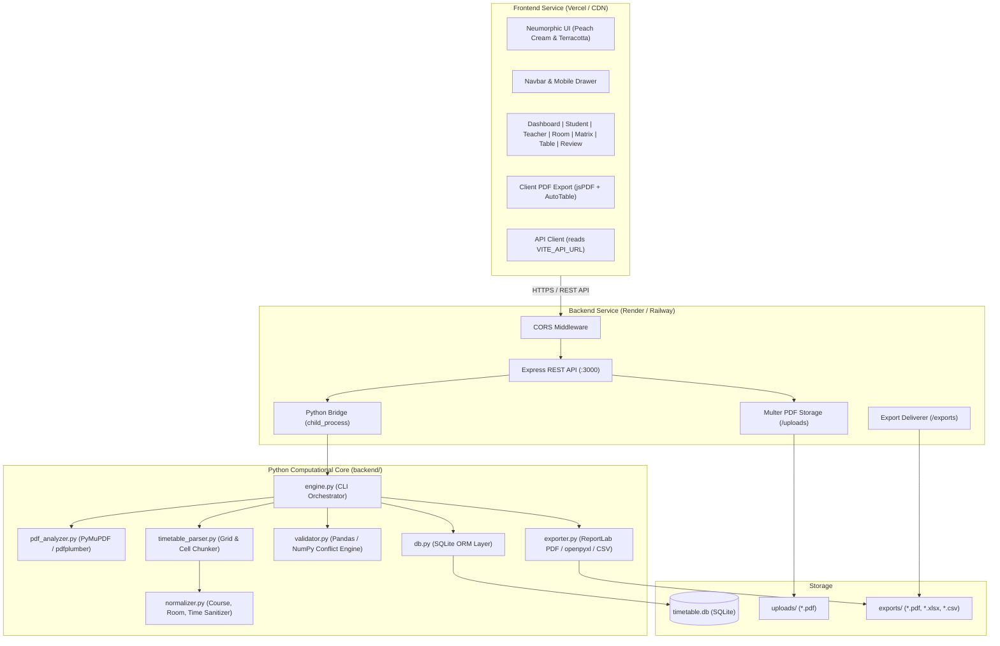

# 🎓 Smart Timetable Analyzer & Master Schedule Ledger

<div align="center">


<p align="center">
  <strong>An Intelligent University Timetable Extraction, Schedule Management, and Conflict Analysis Engine</strong>
  <br />
  Featuring a <em>Peach Cream & Terracotta</em> Neumorphic & Skeuomorphic tactile design system with 100% mobile responsiveness.
  <br />
  <strong>Architected with decoupled, standalone <code>frontend/</code> and <code>backend/</code> services ready for independent production deployment.</strong>
</p>

</div>

---

## 📑 Table of Contents

- [Overview](#-overview)
- [Design Aesthetics & Theme](#-design-aesthetics--theme)
- [Key Features](#-key-features)
- [System Architecture](#-system-architecture)
- [Project Directory Structure](#-project-directory-structure)
- [Tech Stack & Dependencies](#-tech-stack--dependencies)
  - [Frontend Service (`frontend/`)](#frontend-service-frontend)
  - [Backend Service (`backend/`)](#backend-service-backend)
- [REST API Reference](#-rest-api-reference)
- [Local Development Setup](#-local-development-setup)
  - [Prerequisites](#prerequisites)
  - [1. Backend Setup](#1-backend-setup)
  - [2. Frontend Setup](#2-frontend-setup)
- [Production Deployment Guide](#-production-deployment-guide)
  - [Deploying Frontend on Vercel](#deploying-frontend-on-vercel)
  - [Deploying Backend on Render](#deploying-backend-on-render)
  - [Deploying Backend on Railway](#deploying-backend-on-railway)
- [Core Workflows](#-core-workflows)
  - [PDF Parsing Pipeline](#pdf-parsing-pipeline)
  - [Conflict & Anomaly Detection](#conflict--anomaly-detection)
  - [Multi-Format Filter-Aware Exports](#multi-format-filter-aware-exports)
  - [Timetable Version Management](#timetable-version-management)
- [License & Credits](#-license--credits)

---

## 🌟 Overview

Academic timetables published by universities are almost universally distributed as dense, multi-page vector or grid PDF documents. These files often present severe usability hurdles:
- **Overlapping/Clipped text**: Column and cell boundaries in PDFs clip long course titles, instructor names, or room numbers.
- **Inability to filter**: Students and faculty cannot quickly isolate their own sections or courses from hundreds of classes.
- **Undetected schedule conflicts**: Room double-bookings or overlapping instructor assignments often go unnoticed until classes begin.
- **Poor mobile experience**: Viewing large matrix tables on phones requires continuous pinching and zooming.

**Smart Timetable Analyzer** solves this through a decoupled, high-performance architecture:
1. An intelligent Python parsing engine extracting coordinate-anchored lecture cells and resolving canonical degrees, sections, and shifts.
2. An Express.js REST API providing fast filtering, conflict auditing, and export delivery.
3. A React 19 single-page application crafted with a custom **Peach Cream & Terracotta** skeuomorphic design system featuring 100% responsive layouts, role-based views, tactile controls, and dynamic filter-compliant PDF exports.

---

## 🎨 Design Aesthetics & Theme

The user interface is built on a custom **Peach Cream & Terracotta** color palette, combining soft neumorphic raised cards, recessed wells, and physical skeuomorphic buttons:

### Curated Color Palette
- **Canvas / Background**: `#FFF8F2` (Soft warm peach cream)
- **Primary Accent**: `#E76F51` (Rich vibrant terracotta)
- **Primary Hover / Shadow**: `#C05633` (Deep burnt terracotta)
- **Secondary Surface**: `#FCEFE3` (Warm cream peach container)
- **Borders & Insets**: `#D4B8A0` (Subtle warm clay border)
- **Typography (Headings)**: `#3D2B1F` (Espresso dark brown)
- **Typography (Muted/Subtext)**: `#7A6559` & `#A0897D` (Medium warm slate)

### Tactile Neumorphic & Skeuomorphic Primitives
- **`.neu-raised`**: Dual-directional shadows creating a soft, elevated clay plate appearance.
- **`.neu-pressed`**: Sunken inner shadows providing tactile input wells, search bars, and toggle switches.
- **`.skeuo-btn-primary`**: 3D glossy terracotta buttons with bevel highlights, dark bottom lips, and tactile depression on click.
- **LED Indicators**: Glowing green (`.skeuo-led-green`) and red (`.skeuo-led-red`) lights signifying clean grids or conflict warnings.
- **Mobile First & Fully Responsive**: Includes a dedicated mobile hamburger toggle menu drawer, adaptive grids (`1 → 2 → 4` columns), swipe guidance banners, and auto-scrolling dialogs.

---

## 🚀 Key Features

### 1. AI & Coordinate-Anchored PDF Extraction
- Automatically parses multi-page university timetable PDFs with arbitrary grid geometries.
- **Canonical Catalog Extraction**: Inspects master index pages (e.g. Page 1) to identify unclipped, canonical degree names (e.g. `BS Software Engineering Semester 3 Self Support 2 (2025-2029)`) and faculty rosters.
- **Multi-Lecture Cell Chunking**: Detects stacked classes occurring within the same time slot and splits them into distinct database entries.
- **Text Normalization**: Cleans course codes, sanitizes time strings into standardized `HH:MM AM/PM` formats, and computes durations.

### 2. Role-Based Navigation
- **Student View**: Cascading dropdowns (Program ➔ Semester ➔ Section) with day-by-day lecture cards, teacher chips, and room locations.
- **Teacher Schedule**: Instructor picker and quick search filter with total weekly lecture count, teaching days, and cumulative teaching hours.
- **Admin View**: Master database ledger with full CRUD capabilities (Add, Edit, Delete records), column sorting, and paginated browsing.

### 3. Interactive Schedule Views
- **Executive Dashboard**: 8 tactile KPI cards (Total Classes, Programs, Faculty, Rooms, Hours, Active Days, Conflicts, Audit Flags) and a 6-day academic load distribution bar chart.
- **Weekly Master Matrix**: 2D Day × Time cross-reference matrix with swipe hints for mobile and a floating cell inspector dialog.
- **Room & Lab Schedule**: Real-time room occupancy tracker, lab utilization metrics, and free period detection.
- **Extraction Review & Conflict Audit**: Automated conflict detection identifying teacher double-bookings and room collision overlaps.
- **Built-in PDF Viewer**: Side-by-side or modal high-resolution vector PDF inspection with page-jump capabilities.

### 4. Multi-Format Filter-Aware Exports
- **Client-Side Official PDF**: Generates colorful, branded PDFs via `jsPDF` & `jspdf-autotable` with double-line borders, metadata header boxes, colored alternating rows, and active filter compliance.
- **Server-Side ReportLab PDF**: Backend high-resolution vector PDF export with page decoration banners and page numbering.
- **Excel (.xlsx)**: Formatted workbooks with auto-fitted column widths and styled headers.
- **CSV Dataset**: Raw data export for external spreadsheet manipulation.

### 5. Multi-Timetable Version Manager
- Upload and store multiple timetables concurrently in SQLite.
- Seamlessly switch active schedules with one click.
- Safe deletion flow with confirmation prompts.

---

## 🏗 System Architecture



---

## 📁 Project Directory Structure

The project is strictly organized into two independent, self-contained directories:

```text
TimeTableAnalyzer/
│
├── frontend/                       # 🌐 CLIENT APPLICATION (Vercel)
│   ├── src/
│   │   ├── components/
│   │   │   ├── AdminDataTable.tsx          # CRUD database records explorer
│   │   │   ├── DashboardStats.tsx          # 8 KPI cards & load distribution
│   │   │   ├── EditRecordModal.tsx         # Add/Edit record dialog
│   │   │   ├── ExtractionReviewView.tsx    # Conflict diagnostics
│   │   │   ├── Navbar.tsx                  # Tactile navigation & mobile drawer
│   │   │   ├── PdfViewerModal.tsx          # Vector PDF viewer
│   │   │   ├── RoomScheduleView.tsx        # Venue occupancy & lab tracker
│   │   │   ├── StudentScheduleView.tsx     # Student cascading schedule view
│   │   │   ├── TeacherScheduleView.tsx     # Faculty workload analysis
│   │   │   ├── UploadModal.tsx             # PDF upload & parsing modal
│   │   │   └── WeeklyMatrixView.tsx        # 2D Day × Time matrix
│   │   ├── lib/
│   │   │   └── pdfExport.ts                # Client-side jsPDF + AutoTable export
│   │   ├── App.tsx                         # Main app controller
│   │   ├── config.ts                       # API URL configuration (VITE_API_URL)
│   │   ├── index.css                       # Design tokens, Neumorphic utilities
│   │   ├── main.tsx                        # React DOM root mount
│   │   └── types.ts                        # TypeScript interfaces & types
│   ├── index.html                          # HTML template
│   ├── package.json                        # Frontend dependencies & scripts
│   ├── tsconfig.json                       # Frontend TypeScript config
│   ├── vercel.json                         # Vercel SPA routing & cache config
│   ├── vite.config.ts                      # Vite build & local dev proxy setup
│   └── .env.example                        # Frontend env variables reference
│
├── backend/                        # ⚙️ SERVER & PYTHON ENGINE (Render/Railway)
│   ├── data/                               # Database storage directory
│   ├── database/
│   │   └── db.py                           # SQLite schema, queries, versioning
│   ├── services/
│   │   ├── exporter.py                     # ReportLab PDF, openpyxl Excel, CSV
│   │   ├── normalizer.py                   # Time formatting, text sanitation
│   │   ├── pdf_analyzer.py                 # PyMuPDF coordinate inspection
│   │   ├── table_extractor.py              # pdfplumber grid extraction
│   │   ├── timetable_parser.py             # Cell chunking & canonical mapping
│   │   └── validator.py                    # Pandas/NumPy conflict detection
│   ├── uploads/                            # Stored user PDF files
│   ├── exports/                            # Generated export files
│   ├── engine.py                           # Python CLI command orchestrator
│   ├── package.json                        # Backend Node.js dependencies
│   ├── requirements.txt                    # Python pip dependencies
│   ├── server.ts                           # Express API server with CORS
│   ├── tsconfig.json                       # Backend TypeScript config
│   ├── Dockerfile                          # Multi-stage production container
│   ├── render.yaml                         # Render.com deployment blueprint
│   ├── .dockerignore                       # Docker build exclusions
│   ├── .gitignore                          # Backend gitignore
│   └── .env.example                        # Backend env variables reference
│
├── .gitignore                      # Root Git ignore rules
└── README.md                       # Comprehensive documentation
```

---

## 📦 Tech Stack & Dependencies

### Frontend Service (`frontend/`)
| Technology | Version | Purpose |
| :--- | :--- | :--- |
| **React** | `^19.0.1` | Modern declarative UI component library |
| **TypeScript** | `^7.0.2` | Static type checking and interfaces |
| **Vite** | `^8.3.0` | Ultra-fast build tool & dev proxy |
| **Tailwind CSS** | `^4.3.3` | Utility styling with CSS variable support |
| **Lucide React** | `^0.546.0` | Consistent UI icon set |
| **jsPDF** | `^4.2.1` | Client-side vector PDF generation |
| **jspdf-autotable**| `^5.0.8` | Formatted multi-page data tables in PDFs |
| **xlsx (SheetJS)** | `^0.18.5` | Client-side spreadsheet export |
| **canvas-confetti**| `^1.9.4` | Micro-animation celebration triggers |

### Backend Service (`backend/`)
| Technology | Version | Purpose |
| :--- | :--- | :--- |
| **Node.js** | `>=20.0.0` | Server runtime environment |
| **Express.js** | `^4.21.2` | REST API routing and middleware |
| **CORS** | `^2.8.5` | Cross-Origin Resource Sharing handling |
| **Multer** | `^2.4.0` | Multipart/form-data PDF file uploads |
| **esbuild** | `^0.28.0` | High-speed server bundling |
| **Python** | `>=3.11` | Extraction engine & mathematical operations |
| **PyMuPDF (fitz)** | `>=1.23.0` | High-speed PDF layout & coordinate analysis |
| **pdfplumber** | `>=0.10.0` | Visual table boundary detection |
| **pandas** | `>=1.5.0` | Tabular data grouping and conflict analysis |
| **numpy** | `>=1.24.0` | Vector operations and matrix sorting |
| **openpyxl** | `>=3.0.0` | Formatted Excel workbook exports |
| **ReportLab** | `>=4.0.0` | Vector PDF document generation |
| **SQLite3** | Built-in | Relational database storage |

---

## 🔌 REST API Reference

The backend exposes a full suite of REST endpoints:

| Method | Endpoint | Description | Query / Body Parameters |
| :--- | :--- | :--- | :--- |
| `GET` | `/api/health` | Service health status & python binary info | None |
| `POST` | `/api/upload` | Uploads PDF to server storage | Multipart `pdf` file |
| `POST` | `/api/analyze` | Executes Python extraction pipeline | `{ filename, originalName }` |
| `POST` | `/api/upload-and-analyze` | Ingests, parses, and saves PDF in 1 step | Multipart `pdf` file |
| `POST` | `/api/sample-timetable` | Generates and loads default sample schedule | None |
| `GET` | `/api/timetable` | Retrieves active or specific timetable | `?id=<timetable_id>` |
| `GET` | `/api/timetables` | Lists all uploaded timetables with metadata | None |
| `POST` | `/api/timetables/active/:id` | Sets the specified timetable as active | Path `:id` |
| `DELETE`| `/api/timetables/:id` | Deletes a timetable and all its entries | Path `:id` |
| `GET` | `/api/filter` | Filters entries by attributes or search query | `?program=&semester=&teacher=&room=&day=&q=` |
| `GET` | `/api/student-schedule` | Groups entries by day for student views | `?timetableId=&program=&semester=&section=` |
| `GET` | `/api/teacher-schedule` | Computes teaching load and day schedules | `?timetableId=&teacher=` |
| `GET` | `/api/room-schedule` | Computes occupancy for a specific room | `?timetableId=&room=` |
| `PUT` | `/api/records/:id` | Updates a specific class record | Path `:id`, JSON body with fields |
| `DELETE`| `/api/records/:id` | Deletes a specific class record | Path `:id` |
| `GET` | `/api/pdf-view/:id` | Streams the original uploaded PDF | Path `:id` |
| `GET` | `/api/export/pdf` | Downloads filter-compliant ReportLab PDF | `?timetableId=&filterJson=&type=&filter=` |
| `GET` | `/api/export/excel` | Downloads filter-compliant Excel sheet | `?timetableId=&filterJson=&type=&filter=` |
| `GET` | `/api/export/csv` | Downloads filter-compliant CSV dataset | `?timetableId=&filterJson=&type=&filter=` |

---

## 🛠 Local Development Setup

### Prerequisites
- **Node.js**: `v18.0.0` or higher
- **Python**: `v3.10` or higher with `pip`

---

### 1. Backend Setup

Open a terminal window:

```bash
cd backend

# Install Node.js dependencies
npm install

# Install Python dependencies
pip install -r requirements.txt

# Start backend server (runs on port 3000)
npm run dev
```

The backend starts at `http://localhost:3000`. You can verify health at `http://localhost:3000/api/health`.

---

### 2. Frontend Setup

Open a **second** terminal window:

```bash
cd frontend

# Install frontend dependencies
npm install

# Start frontend development server (runs on port 5173)
npm run dev
```

Open your browser at `http://localhost:5173`.
During local development, Vite automatically proxies all `/api/*` calls from port `5173` to `http://localhost:3000`.

---

## 🚀 Production Deployment Guide

### Deploying Frontend on Vercel

1. Push your repository to GitHub.
2. Log in to [Vercel](https://vercel.com/) and click **Add New Project**.
3. Select your repository: `TimeTableAnalyzer`.
4. Under **Project Settings**:
   - **Root Directory**: Select `frontend` (Click *Edit* and choose the `frontend` folder).
   - **Framework Preset**: Vite (detected automatically).
   - **Build Command**: `npm run build`
   - **Output Directory**: `dist`
5. Under **Environment Variables**, add:
   - `VITE_API_URL`: `https://your-backend.onrender.com` *(your deployed backend URL)*
6. Click **Deploy**.

> **Note**: `frontend/vercel.json` is already configured with SPA rewrites so client-side routing works flawlessly.

---

### Deploying Backend on Render

The backend requires Node.js, Python, and system packages, which are fully containerized via `backend/Dockerfile`.

1. Log in to [Render](https://render.com/).
2. Click **New +** ➔ **Web Service**.
3. Connect your GitHub repository: `TimeTableAnalyzer`.
4. Configure the service settings:
   - **Root Directory**: `backend`
   - **Environment**: `Docker`
   - **Dockerfile Path**: `Dockerfile`
   - **Region**: Choose the region closest to your users.
   - **Instance Type**: Free or Starter.
5. Under **Environment Variables**, add:
   - `PORT`: `3000`
   - `CORS_ORIGIN`: `*` *(or your Vercel URL, e.g. `https://your-app.vercel.app`)*
   - `NODE_ENV`: `production`
   - `PYTHON_BIN`: `python3`
6. Click **Create Web Service**.

> Render will build the container, install both Python requirements and Node modules, and expose the API over HTTPS. Once deployed, copy your Render service URL and add it as `VITE_API_URL` in Vercel!

---

### Deploying Backend on Railway

1. Log in to [Railway](https://railway.app/).
2. Click **New Project** ➔ **Deploy from GitHub repo**.
3. Select `TimeTableAnalyzer`.
4. In **Settings** ➔ **Root Directory**, set: `/backend`.
5. Railway will automatically detect `backend/Dockerfile`.
6. Add environment variable:
   - `CORS_ORIGIN`: `*`
7. Click **Deploy**.
8. In the **Networking** section, click **Generate Domain** to get your public API URL.

---

## 🔬 Core Workflows

### PDF Parsing Pipeline
1. **Coordinate Analysis**: `pdf_analyzer.py` inspects page dimensions, tables, and bounding boxes using `PyMuPDF` and `pdfplumber`.
2. **Canonical Mapping**: The engine examines header blocks and index tables to construct a canonical dictionary of degree programs, batches, and shifts.
3. **Multi-Lecture Chunking**: When multiple classes share a cell or time slot, `timetable_parser.py` isolates individual blocks using regex and text layout markers.
4. **Data Normalization**: `normalizer.py` sanitizes time spans (e.g. `08:30-10:00`), maps faculty initials to full names, and extracts room identifiers.
5. **Database Storage**: The parsed dataset is committed atomically to SQLite with version tracking.

### Conflict & Anomaly Detection
- **Teacher Double-Booking**: Evaluates whether an instructor has overlapping time allocations on the same day.
- **Room Collisions**: Identifies if two distinct classes occupy the same room at overlapping hours.
- **Confidence Scoring**: Flags anomalous entries (e.g. missing room or ambiguous subject) for administrative review.

### Multi-Format Filter-Aware Exports
- When filters are active (e.g. searching for a teacher or course), exports reflect **only the filtered dataset**.
- Client-side PDF generation provides instant, crisp vector documents formatted with official header ledger strips.

---

## 📜 License & Credits

Developed with precision for academic institutions. Built using open-source libraries:
- [PyMuPDF](https://github.com/pymupdf/PyMuPDF)
- [pdfplumber](https://github.com/jsvine/pdfplumber)
- [React](https://react.dev/) & [Vite](https://vitejs.dev/)
- [Tailwind CSS](https://tailwindcss.com/)
- [ReportLab](https://www.reportlab.com/) & [jsPDF](https://github.com/parallax/jsPDF)
